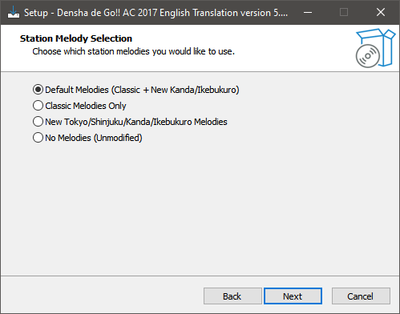
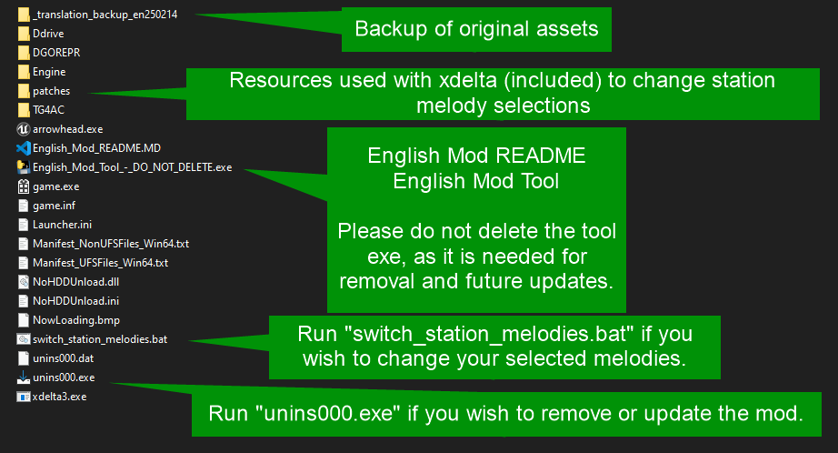

# Densha-de-Go-AC-2017-English-Translation
Fan Translation for Densha de Go!! 2017 Arcade Version (TG4AC) 

Thank you for downloading our English translation of Densha de Go!!

## Game Version
This translation was built using Densha de Go!! AC 2017 version 5.80.02. Other versions are untested and may or may not work, YMMV.

Also, please only install this mod on an untranslated copy of the game, as the patch will not work on modified data.

## Installation Instructions

1. Download and run the latest installer from [Releases](https://github.com/mikaeltarquin/Densha-de-Go-AC-2017-English-Translation/releases).

2. At the Select Destination Location screen, choose the location of your Densha de Go!! game directory (the folder that contains the DGOREPR, Engine, and TG4AC folders, among other files). For example, if your game directory looks like <code>C:\Games\Densha5.80.02\TG4AC\Binaries\...</code>, then you should enter <code>C:\Games\Densha5.80.02</code> in this field. The installer will automatically enter the folder name "New Folder" if you use the Browse button, so take care when editing this field. Press Next, then Yes to confirm you would like to install in the existing game folder. 
   

3. On the next screen, choose a set of Station Melodies. These can be changed later using the included `switch_station_melody.bat`.

   
4. At the final screen, verify the destination location is correct (I'll repeat it, this should be the directory that is just above the DGOREP, Engine, and TG4AC folders). Press Install to apply the translation mod to your game.
   

5. ~~出発進行~~ _Proceed with departure!!_

## Uninstallation and Update Instructions
After clicking Finish, there will be a few leftover items in your main game folder:
- /_translation_backup_<version number>/
- /patches/music/
- English_Mod_README.md
- English_Mod_Tool_-_DO_NOT_DELETE.exe
- switch_station_melodies.bat
- unins000.dat and unins000.exe

If you would like to change your selection of station melodies, run `switch_station_melody.bat` and follow the on-screen prompts.

If you would like to revert your game to Japanese, double-click on "unins000.exe", or open Apps & Features in your Windows Settings menu and use the "Remove Densha de Go!! AC 2017 English Translation" option. This will restore the original files and remove the backup, English Mod Tool, and uninstaller from your main game folder.

If you are updating to a new Release, please RUN THE UNINSTALLER BEFORE RUNNING THE NEW INSTALLER. This will return your game to Japanese and remove all previously installed mod files, ensuring compatibility.

## Project Page
https://github.com/mikaeltarquin/Densha-de-Go-AC-2017-English-Translation

## Copyright
No copyright materials, assets, or game data are included in this mod. This mod is not affiliated or endorsed by Taito, Square Enix, or Japan Railways Group.

## Credits
Michael Anderson (MikaelTarquin), Dan "Alpha", Sponge, Entaroadun, Funkyspectrum. 

## Sample Images

